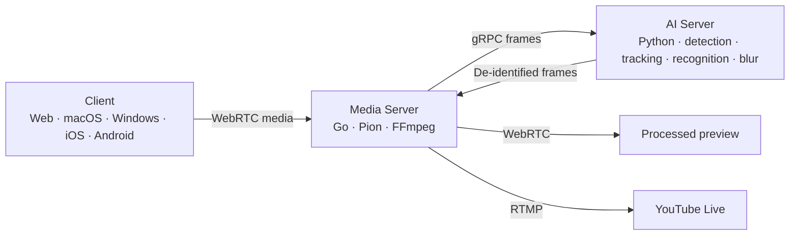

# InnoLive

AI-powered real-time video de-identification for live streaming

InnoLive reduces the exposure of bystanders' faces and vehicle license plates during live broadcasts. Broadcasters register participants in advance, and the video pipeline obscures surrounding faces and license plates.

[Web demo](https://innolive.studio/) · [Source code](https://github.com/orgs/team-framework/repositories) · [한국어](README.md)

## Privacy during live broadcasts

During an outdoor broadcast or on-location interview, broadcasters operate the camera while checking the scene. Checking background faces and license plates is difficult.
Live broadcasts deliver captured video to viewers shortly after recording, so de-identification must happen before broadcasting.

InnoLive connects camera capture, AI de-identification, processed previews, and broadcast output in one workflow.

| Feature | Behavior |
| --- | --- |
| Face and license plate de-identification | AI applies blur to detected faces and vehicle license plate regions. |
| Registered participant exceptions | Broadcasters register face photos, and AI excludes matching faces from blur processing. This exception applies to faces only. |
| Original and processed previews | Broadcasters inspect the camera view and the server-processed preview. |
| YouTube Live integration | Broadcasters prepare a broadcast through a connected account, review the preview, and go live. |

## Broadcast workflow

1. Configure the camera and microphone, then register the faces of participants to exclude from blurring.
2. Enable de-identification and inspect the processed preview.
3. Connect a YouTube account, save the broadcast settings, and select **Prepare broadcast**.
4. Review the prepared output and select **Go live** to make the broadcast visible to viewers.

Try the web demo on the [InnoLive website](https://innolive.studio/). Find app launch instructions in the [client guide](https://github.com/team-framework/innolive-client#빠른-실행).

## Processing architecture

The client captures video and audio, then negotiates its WebRTC connection with the server through WebSocket signaling. The client and server use STUN/TURN settings to find an ICE path. A TURN server relays media when a direct connection is unavailable.

The media server sends video frames to the AI server. The AI server uses YOLO-based segmentation and BoT-SORT to detect and track faces and license plates. It uses YuNet and AdaFace to match faces against registered participants, blurs unregistered or unconfirmed faces and license plates, and returns the frames. The media server encodes the result for previews and broadcast platforms.

## Platform composition

InnoLive consists of platform-native clients for Web, iOS, and Android.

| Platform | Main technologies | Form |
| --- | --- | --- |
| Web | TypeScript · Next.js · React · MediaPipe | Public web demo available |
| iOS | Swift · SwiftUI · AVFoundation | Native mobile client |
| Android | Kotlin · Jetpack Compose · CameraX | Native mobile client |

## AI processing performance

InnoLive AI processes a de-identification frame in approximately 24ms on a fixed Benchmark Set separate from training data. We used 1920×1080 PNG input at 30 FPS and measured from image input to the final blurred output.

| Measurement | Result |
| --- | --- |
| Hardware | Ryzen 7900 · 64GB DDR5 · RTX 3090 24GB |
| Model processing time | V4: 23.6ms · V6: 23.9ms |
| Measurement range | AI image input to final blurred output |
| Broadcast transport | A separate metric from AI processing time |

This result covers the AI frame-processing stage. WebRTC transmission between the client and server and delivery through the broadcast platform require separate metrics. Measurement methods and tools are available in the [AI repository](https://github.com/team-framework/innolive-ai).

## Code and documentation

| Repository | Responsibility |
| --- | --- |
| [innolive-client](https://github.com/team-framework/innolive-client) | Platform UI, camera and microphone controls, face registration, previews, and broadcast controls |
| [innolive-server](https://github.com/team-framework/innolive-server) | WebRTC sessions, media processing, AI integration, and YouTube output |
| [innolive-ai](https://github.com/team-framework/innolive-ai) | Face and license plate detection, tracking, participant recognition, and blur composition |

[Client architecture](https://github.com/team-framework/innolive-client/blob/main/docs/architecture.md) · [YouTube broadcast lifecycle](https://github.com/team-framework/innolive-client/blob/main/contracts/api/youtube-broadcast-v1.md) · [AI models and weights](https://github.com/team-framework/innolive-ai/blob/main/models/README.md)

Find setup instructions and licensing in each repository. Use the relevant repository's Issues for bug reports and technical questions.

## Team Framework

| Name | Role |
| --- | --- |
| [채근영](https://github.com/chaeyn) | Team Leader · Software Engineer |
| [김연호](https://github.com/Finefinee) | Software Engineer |
| [권대형](https://github.com/daehyeong2) | ML Engineer |
| [정대원](https://github.com/jdw09) | Software Engineer |
| [천준범](https://github.com/itzjb) | Software Engineer |
| [황정빈](https://github.com/hjbin-25) | Software Engineer |
