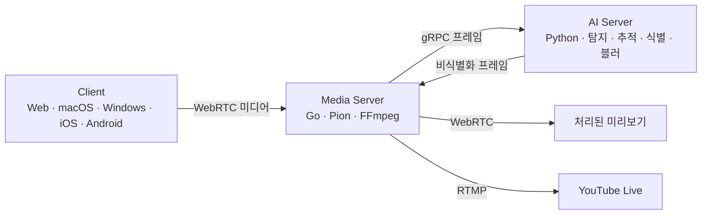

# InnoLive

AI 기반 실시간 비식별화 솔루션

InnoLive는 라이브 방송에서 행인의 얼굴과 차량 번호판 노출을 줄입니다. 방송인은 출연자의 얼굴을 미리 등록하고, 영상 처리 과정에서 주변 인물과 번호판을 가립니다.

[웹 체험](https://innolive.studio/) · [소스 코드](https://github.com/orgs/team-framework/repositories) · [English](README.en.md) · [README for NAVER OGQ AI COMPETITON](README.ogq.md)

## 방송 중 개인정보 보호

야외 방송과 현장 인터뷰에서 방송인은 카메라를 조작하면서 배경의 얼굴과 번호판까지 확인하기 어렵습니다.
라이브 방송은 촬영한 영상을 곧바로 시청자에게 전달하므로, 방송 전에 비식별화해야 합니다.

InnoLive는 카메라 영상 수집부터 AI 비식별화, 처리 화면 확인, 방송 송출까지 한 과정으로 연결합니다.

| 기능 | 동작 |
| --- | --- |
| 얼굴·번호판 비식별화 | AI가 탐지한 얼굴과 차량 번호판 영역에 블러를 적용합니다. |
| 등록 인물 예외 처리 | 방송인이 얼굴 사진을 등록하면 AI가 일치한 얼굴을 블러 처리 대상에서 제외합니다. 이 예외는 얼굴에만 적용합니다. |
| 원본·처리 화면 확인 | 방송인은 촬영 화면과 서버가 처리한 미리보기를 확인합니다. |
| YouTube 라이브 연동 | 방송인은 연결한 계정으로 방송을 준비하고, 미리보기를 확인한 뒤 라이브를 시작합니다. |

## 사용 흐름

1. 카메라와 마이크를 연결하고, 비식별화에서 제외할 출연자의 얼굴을 등록합니다.
2. 비식별화를 켜고 처리된 미리보기를 확인합니다.
3. YouTube 계정을 연결하고 방송 설정을 저장한 뒤 **방송 준비**를 누릅니다.
4. 준비된 화면을 확인하고 **라이브 시작**을 눌러 시청자에게 공개합니다.

웹 체험은 [InnoLive 웹사이트](https://innolive.studio/)에서 할 수 있습니다. 앱 실행 방법은 [클라이언트 안내](https://github.com/team-framework/innolive-client#빠른-실행)에서 확인할 수 있습니다.

## 처리 구조

클라이언트는 영상과 음성을 수집하고, WebSocket 시그널링으로 서버와 WebRTC 연결을 협상합니다.
클라이언트와 서버는 STUN/TURN 설정을 사용해 ICE 통신 경로를 찾습니다. 직접 연결이 어려운 환경에서는 TURN 서버가 미디어를 중계합니다.

미디어 서버는 영상 프레임을 AI 서버에 전달합니다. AI 서버는 YOLO 기반 세그멘테이션과 BoT-SORT로 얼굴과 번호판을 탐지하고 추적합니다. YuNet과 AdaFace로 등록 인물과 얼굴을 대조한 뒤, 미등록·미확인 얼굴과 번호판을 블러 처리해 반환합니다. 미디어 서버는 결과를 인코딩해 미리보기와 방송 플랫폼으로 전송합니다.

## 플랫폼 구성

InnoLive는 Web, iOS, Android용 플랫폼별 네이티브 클라이언트로 구성됩니다.

| 플랫폼 | 주요 기술 | 형태 |
| --- | --- | --- |
| Web | TypeScript · Next.js · React · MediaPipe | 공개 웹 체험 제공 |
| iOS | Swift · SwiftUI · AVFoundation · Apple Vision | 네이티브 모바일 클라이언트 |
| Android | Kotlin · Jetpack Compose · CameraX | 네이티브 모바일 클라이언트 |

## AI 처리 성능

InnoLive AI는 학습 데이터와 분리한 고정 Benchmark Set에서 비식별화 프레임을 약 24ms에 처리했습니다. 1920×1080 PNG 입력을 30 FPS 기준으로 사용했고, 이미지 입력부터 최종 블러 출력까지 측정했습니다.

| 측정 기준 | 결과 |
| --- | --- |
| 하드웨어 | Ryzen 7900 · DDR5 64GB · RTX 3090 24GB |
| 모델별 처리 시간 | V4 23.6ms · V6 23.9ms |
| 측정 범위 | AI 이미지 입력부터 최종 블러 출력까지 |
| 방송 전송 구간 | AI 처리 시간과 별도 지표로 확인 |

이 결과는 AI 프레임 처리 구간의 측정값입니다. 클라이언트와 서버 사이의 WebRTC 전송과 방송 플랫폼 전달 지연은 별도 지표로 확인해야 합니다. 측정 방법과 도구는 [AI 레포지토리](https://github.com/team-framework/innolive-ai)에서 확인할 수 있습니다.

## 코드와 문서

| 레포지토리 | 담당 영역 |
| --- | --- |
| [innolive-client](https://github.com/team-framework/innolive-client) | 플랫폼별 UI, 카메라·마이크, 얼굴 등록, 미리보기와 방송 제어 |
| [innolive-server](https://github.com/team-framework/innolive-server) | WebRTC 세션, 미디어 처리, AI 연동, YouTube 송출 |
| [innolive-ai](https://github.com/team-framework/innolive-ai) | 얼굴·번호판 탐지, 추적, 등록 인물 식별, 블러 합성 |

[클라이언트 아키텍처](https://github.com/team-framework/innolive-client/blob/main/docs/architecture.md) · [YouTube 방송 흐름](https://github.com/team-framework/innolive-client/blob/main/contracts/api/youtube-broadcast-v1.md) · [AI 모델·가중치 안내](https://github.com/team-framework/innolive-ai/blob/main/models/README.md)

실행 방법과 라이선스는 각 레포지토리에서 확인할 수 있습니다. 오류 제보와 기술 문의는 해당 레포지토리의 Issues를 이용해 주세요.

## 팀 Framework

| 이름 | 역할 |
| --- | --- |
| [채근영](https://github.com/chaeyn) |  Team Leader· Software Engineer |
| [김연호](https://github.com/Finefinee) | Software Engineer  |
| [권대형](https://github.com/daehyeong2) | ML Engineer  |
| [정대원](https://github.com/jdw09) | Software Engineer  |
| [천준범](https://github.com/itzjb) | Software Engineer  |
| [황정빈](https://github.com/hjbin-25) | Software Engineer  |
