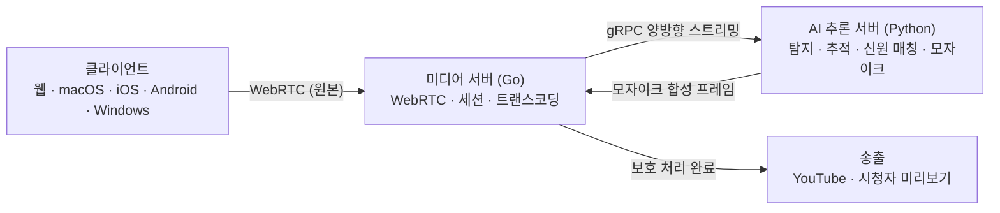

# InnoLive  
  
실시간 비식별화 방송 시스템 — 방송은 그대로, 개인정보는 AI가 알아서.  
  
손쉬운 개인정보 보호 · 초저지연 처리 및 방송 송출 · 선택적 비식별화  
  
**> 체험하기 — [innolive.chaeyn.com](https://innolive.chaeyn.com/)** · 설치 없이 브라우저에서 바로 실행됩니다.  

---  
  
## 문제 정의  
  
방송 시장이 커지며 야외 방송을 하는 스트리머도 많아졌습니다. 그렇다면 그 화면에 노출되는 행인의 초상권은 어디로 갔을까요. 초상권 침해가 반복되는 원인은 스트리머 개인의 부주의가 아니라 라이브 방송이라는 구조적 한계에 있습니다.  
  
| 구조적 한계 | 내용 |  
| --- | --- |  
| 혼자서 관리하는 스트리밍 | 야외 라이브는 대부분 스트리머 혼자 진행과 촬영을 겸합니다. 방송을 이어가면서 화면에 지나가는 행인의 얼굴을 실시간으로 확인하고 대응하는 것은 물리적으로 어렵습니다 |  
| 즉시 송출되는 영상 | 촬영과 동시에 송출되므로, 문제가 되는 장면이 있어도 이미 나간 뒤라 되돌릴 수 없습니다 |  
| 2차 콘텐츠의 확산 | 송출된 영상은 다시보기, 클립, 숏폼으로 재가공되어 여러 플랫폼으로 퍼집니다. 원본을 삭제해도 잘려나간 클립까지 회수할 수는 없습니다 |  
  
대처 방법도 마땅치 않습니다. 피해자가 직접 영상을 찾아 초상권 침해임을 증명하고 민사 소송이나 손해배상 청구를 진행해야 합니다. 피해를 입은 쪽이 오히려 더 많은 시간과 노력을 들여야 하는 구조입니다.  
  
이미 법적으로 다뤄지는 문제이기도 합니다. 2025년 법원은 SNS에 타인이 등장하는 영상을 동의 없이 올린 사건에서 초상권 침해를 인정하고 위자료 200만 원을 명령했습니다. 치지직 역시 방송 가이드라인에서 동의 없는 타인의 사진·영상 게시를 제재 대상으로 규정하고 있습니다.  
  
---  
  
## 서비스 소개  
  
InnoLive는 실시간 방송 영상에 등장하는 인물을 AI로 탐지하고, 등록된 인물을 제외한 주변 인물의 얼굴을 자동으로 비식별화하는 라이브 방송 솔루션입니다.  
  
| 기능 | 설명 |  
| --- | --- |  
| 얼굴 인식 및 자동 비식별화 | 등록된 인물을 제외한 모든 얼굴에 비식별화를 적용합니다. 야외 방송 중 행인의 초상권을 별도 조작 없이 보호합니다 |  
| 얼굴 등록 | 방송에 등장할 인물의 얼굴을 미리 등록하면 비식별화 대상에서 제외됩니다. 여러 명이 등장하는 경우에도 적용됩니다 |  
| 초저지연 처리 및 방송 송출 | 비식별화로 인한 지연은 통상 1초 이내이며, 서버에서 곧바로 송출되므로 기존 방송의 지연시간과 차이가 크지 않습니다 |  
| 익숙한 UI/UX | OBS Studio, PRISM Live Studio 등 기존 방송 프로그램에 익숙한 사용자가 별도 학습 없이 쓸 수 있도록 화면 흐름을 설계했습니다 |  
  
### 접근을 뒤집었습니다  
  
보통의 비식별화는 가릴 사람을 찾아서 가립니다. 이 방식은 탐지에 실패하는 순간 그대로 노출로 이어집니다.  
  
InnoLive는 기본값을 전원 보호로 두고 등록된 인물만 예외로 뺍니다. 등록되지 않은 사람은 화면에 들어오는 순간부터 보호되므로, 누가 나타날지 모르는 라이브 환경에서도 보호가 새지 않습니다.  
  
같은 원칙이 장애 상황에도 적용됩니다(fail-closed). AI 처리가 실패하면 원본을 내보내는 대신 화면을 차단하고, 인식 모델을 불러오지 못한 경우에도 서비스는 계속되지만 모든 얼굴을 가립니다. 편의보다 보호가 우선입니다.  
  
InnoLive의 목표는 야외 방송에서 일일이 처리해야 했던 번거로운 편집 과정을 줄이고, 개인의 초상권이 당연하게 보호되는 방송 환경을 만드는 것입니다.  
  
---  
  
## 기존 서비스와의 차별점  
  
실시간 비식별화를 제공하는 서비스는 이미 있지만, 대상 사용자와 기능이 다릅니다.  
  
| 항목 | ipcamlive | AXIS Communications | InnoLive |  
| --- | --- | --- | --- |  
| 대상 | IPCam | 네트워크 카메라 |  **야외 라이브 방송** |  
| 실시간 비식별화 | 제공 | 제공 | **제공** |  
| 선택적 인물 비식별화 | 미제공 | 미제공 | **제공** |  
| 방송 송출 | 제공 | 미제공 | **제공** |  
| 방송 화면 편집 | 미제공 | 미제공 | **제공**  |  
  
나머지 두 서비스는 IPCam과 네트워크 카메라를 대상으로 하므로 야외 라이브 방송에는 적합하지 않습니다. 선택적 인물 비식별화와 방송 송출에서도 차이가 있습니다.  
  
---  
  
## 아키텍처  
  

  
1. 방송 주체가 촬영 대상자의 얼굴을 등록합니다 (인물당 여러 장, 방송 중에도 즉시 반영).  
2. 클라이언트가 카메라 영상을 WebRTC로 미디어 서버에 보냅니다.  
3. 미디어 서버가 프레임을 gRPC 양방향 스트림으로 AI 서버에 넘깁니다.  
4. AI 서버가 얼굴을 세그멘테이션으로 탐지하고 추적으로 동일 인물을 유지하며, 등록된 인물만 제외한 뒤 나머지를 모자이크 처리해 돌려줍니다.  
5. 보호 처리가 끝난 영상만 시청자와 YouTube RTMP로 나갑니다.  
  
세션 수 admission control(초과 시 503), 트랜스코더 동시 기동 제어, 소유자 토큰 기반 세션 하이재킹 방지가 서버에 들어가 있고, 화이트리스트는 세션 단위로 격리됩니다.  
  
---  
  
## 저장소  
  
| 저장소                                                                  | 역할                                                            | 공개  |
| -------------------------------------------------------------------- | ------------------------------------------------------------- | --- |
| [innolive-server](https://github.com/team-framework/innolive-server) | WebRTC 미디어 서버 (Go) — 세션·시그널링·트랜스코딩·AI 워커 풀·RTMP 송출            | 공개  |
| [innolive-ai](https://github.com/team-framework/innolive-ai)         | AI 추론 서버 (Python) — 탐지·추적·신원 매칭·모자이크 합성 gRPC 서비스              | 공개  |
| [innolive-client](https://github.com/team-framework/innolive-client) | 네이티브 멀티플랫폼 클라이언트 모노레포 (web · macOS · iOS · Android · Windows) | 비공개 |
  
---  
  
## 사용 스택  
  
| 영역                     | 스택                                                                                                                                                             |
| ---------------------- | -------------------------------------------------------------------------------------------------------------------------------------------------------------- |
| 미디어 서버 (Go 1.25)       | `Pion WebRTC v4` · `gRPC` · `gorilla/websocket` · `GORM` + `PostgreSQL` · `golang-migrate` · `FFmpeg(libvpx / libx264 / AAC)`                                  |
| AI 추론 서버 (Python 3.12) | `Ultralytics YOLO`(세그멘테이션) · `BoT-SORT`(추적) · `AdaFace`(신원 매칭) · `YuNet`(얼굴 정렬) · `PyTorch` · `OpenCV` · `TensorRT`                                            |
| 클라이언트 · Web            | `TypeScript` · `Next.js` · `React 19` · `Tailwind CSS` · `MediaPipe Tasks Vision` · `PostgreSQL`                                                               |
| 클라이언트 · macOS          | `Swift` · `SwiftUI` · `AppKit` · `Combine` · `AVFoundation` · `CoreImage` · `CoreVideo` · `CoreGraphics` · `ScreenCaptureKit` · `Vision` · `WebKit` · `WebRTC` |
| 클라이언트 · Windows        | `C#` · `.NET 10` · `WinUI 3` · `XAML` · `WebView2` · `HttpClient` · `MVVM 패턴`                                                                                  |
| 클라이언트 · iOS            | `Swift` · `SwiftUI` · `AVFoundation` · `AuthenticationServices`                                                                                                |
| 클라이언트 · Android        | `Kotlin` · `Jetpack Compose` (도입 예정)                                                                                                                           |
| 인프라                    | `systemd` · `Docker Compose` · `Caddy(TLS)` · `coturn(TURN)` · `Prometheus` + `Grafana`                                                                        |

- 기술적으로 특기할 만한 부분  
  - **요청 파이프라이닝 + 직렬 추론 레인** — 스트림마다 응답 대기 프레임을 최대 5장까지 겹쳐 네트워크 지연을 숨기고, 추론 자체는 프로세스당 하나의 레인에서 순서대로 처리합니다. 동시 방송이 늘어도 GPU 큐가 무한히 부풀지 않습니다.
  - **폴리곤 단위 비식별화** — 바운딩 박스가 아니라 세그멘테이션 폴리곤 기준으로 가우시안 블러를 적용해, 얼굴 주변 배경까지 뭉개지지 않습니다.  
  - **AI 워커 풀** — 미디어 서버가 여러 AI 워커 프로세스에 라운드로빈으로 분산해 Python GIL에 묶이지 않고 GPU를 채웁니다.  
  - **부팅 프리플라이트** — 기동 시 합성 프레임을 실제로 왕복시켜 AI 서버와의 계약을 검증한 뒤에만 서비스를 엽니다.  
  
---  
  
## 실행 방법  
  
[innolive.chaeyn.com](https://innolive.chaeyn.com/)에서 `시작하기`를 누르면 저희의 메인 기능을 체험할 수 있습니다. 설치도 회원가입도 필요 없습니다.  
  
- 로컬에서 직접 구동하기  
      
    두 서버가 gRPC로 연결되므로 AI 서버를 먼저 실행합니다.  
      
    ```bash
    # 1) AI 추론 서버
    git clone https://github.com/team-framework/innolive-ai && cd innolive-ai
    python3 -m venv .venv && .venv/bin/pip install -r requirements.txt
    # 모델 아티팩트는 models/README.md의 공식 출처에서 내려받아 기본 경로에 둡니다
    .venv/bin/python ai_processor_server.py --backend auto --device auto

    # 2) 미디어 서버 (새 터미널)
    git clone https://github.com/team-framework/innolive-server && cd innolive-server
    cp .env.example .env    # AI_PRIVACY_MODE=real, AI_GRPC_TARGETS 설정
    go run ./cmd/server
    ```
    브라우저에서 `http://localhost:8000/client/`로 접속합니다. `docker compose up`으로 한 번에 띄울 수도 있습니다. 카메라 접근은 브라우저 정책상 HTTPS 또는 localhost에서만 허용됩니다.
    
    자세한 환경변수와 빌드 옵션은 각 저장소의 README를 참고하세요.
      
---  
  
## AI 사용 내역  
  
### 사용한 AI 모델  
  
| 모델                                                 | 용도                                                                                                                                   | 출처 · 라이선스                                                                                                                                                                |
| -------------------------------------------------- | ------------------------------------------------------------------------------------------------------------------------------------ | ------------------------------------------------------------------------------------------------------------------------------------------------------------------------ |
| YOLO26n-seg 얼굴 세그멘테이션 (`best.pt`)              | 프레임별 얼굴 마스크 검출                                                                                                                       | Ultralytics `yolo26n-seg` 사전학습 가중치에 WIDER FACE 파생 데이터셋을 파인튜닝한 자체 체크포인트 (100 epochs · imgsz 640) — AGPL-3.0                                                           |
| BoT-SORT                                           | 스트림별 얼굴 트랙 유지 — Kalman filter + IoU 연관(LAPJV) + GMC(sparseOptFlow) 카메라 모션 보상. ReID 미사용                                           | Ultralytics 내장, AGPL-3.0                                                                                                                                                 |
| AdaFace ViT-Base KP-RPE (WebFace12M)               | 등록 인물 512-D 임베딩 · 비식별화 제외 판정                                                                                                         | [AdaFace](https://github.com/mk-minchul/AdaFace) — 학습 방법 · [CVLFace](https://github.com/mk-minchul/CVLface) — ViT KP-RPE 구현체와 가중치 출처. 코드 MIT, 가중치는 학습 데이터 라이선스 준수 필요 |
| AdaFace IR-18 / IR-50 / IR-101                 | 선택적 대체 백본 (`--adaface-architecture`로 선택, 기본 경로 아님)                                                                              | [AdaFace](https://github.com/mk-minchul/AdaFace) — 코드 MIT. IR-18 CASIA / WebFace4M 체크포인트 출처는 `models/README.md`에 명시                                                  |
| YuNet (`face_detection_yunet_2023mar`)             | 얼굴 5점 랜드마크 검출 → 112×112 정렬                                                                                                           | [OpenCV Zoo](https://github.com/opencv/opencv_zoo), MIT                                                                                                                  |
| MediaPipe BlazeFace short-range                    | 웹 얼굴 등록 화면의 브라우저 측 얼굴 검출                                                                                                             | Google MediaPipe, Apache-2.0                                                                                                                                             |
| Apple Vision (`VNDetectFaceRectangles`)            | macOS 얼굴 등록 화면의 온디바이스 얼굴 검출                                                                                                          | Apple 시스템 프레임워크                                                                                                                                                          |
| TensorRT (+ ONNX · onnxslim · NVIDIA ModelOpt) | FP16 고정배치 추론 최적화 (NVIDIA 전용 경로) — `best.pt` → ONNX → onnxslim 단순화 → ModelOpt AutoCast FP16 → TensorRT 엔진(static batch 1 · 640px) | NVIDIA, 독자 라이선스                                                                                                                                                          |
  
모델 가중치의 원저작자 고지와 라이선스 전문은 `innolive-ai/THIRD_PARTY_NOTICES.md`에, 체크포인트 출처·SHA-256은 `innolive-ai/models/README.md`에 있습니다. 가중치 파일 자체는 재배포하지 않고 출처 링크와 해시만 제공합니다.  
  
### 개발에 사용한 AI 도구  
  
`Claude Code` · `OpenAI Codex` · `OpenCode` — 코드 작성, 리팩터링, 테스트 생성, 성능 분석에 활용했습니다.  
  
### 오픈소스 패키지

- 레포별 전체 목록
    - innolive-server — Go 1.25
        
        | 패키지 | 용도 |
        | --- | --- |
        | `pion/webrtc/v4` | WebRTC 코어 |
        | `pion/rtp` | RTP 패킷 파싱 |
        | `pion/logging` | WebRTC 로깅 |
        | `gorilla/websocket` | 시그널링 WebSocket |
        | `google/uuid` | 세션·사용자 ID |
        | `grpc-go` | AI 서버 gRPC 클라이언트 |
        | `protobuf` | 생성 코드 런타임 |
        | `gorm.io/gorm` | ORM |
        | `gorm.io/driver/postgres` | PostgreSQL 드라이버 |
        | `golang-migrate/migrate` | SQL 마이그레이션 |
        | `golang.org/x/sys` | 프로세스 자원 측정 (Windows) |
        | `FFmpeg` | 외부 실행 바이너리 — VP8 트랜스코딩, RTMP 송출 (libvpx · libx264 · AAC) |
        
    - innolive-ai — Python 3.12
        
        | 패키지 | 용도 |
        | --- | --- |
        | `ultralytics` | YOLO 세그멘테이션 추론, BoT-SORT 트래커 |
        | `torch` | 추론 런타임 |
        | `torchvision` | 비전 유틸리티 |
        | `opencv-python` | 이미지 디코드, 모자이크 합성 |
        | `numpy` | 배열 연산 |
        | `lap` | 트래커 할당 문제 해결 |
        | `grpcio` | gRPC 서버 |
        | `grpcio-health-checking` | 헬스체크 |
        | `protobuf` | 생성 코드 런타임 |
        | `fastapi` · `uvicorn` · `websockets` | 시연용 브라우저 게이트웨이 |
        
        | 선택 설치 | 용도 |
        | --- | --- |
        | `tensorrt-cu12` · `nvidia-ml-py` | TensorRT 추론 경로 |
        | `onnx` · `onnxruntime-gpu` · `onnxslim` · `nvidia-modelopt` | TensorRT 엔진 빌드 |
        | `grpcio-tools` · `ruff` · `httpx2` | 개발·테스트 |
        
    - innolive-client — 플랫폼별
        
        | 플랫폼 | 오픈소스 |
        | --- | --- |
        | Web | `Next.js` · `React` · `React DOM` · `Tailwind CSS` · `MediaPipe Tasks Vision` |
        | Windows | `Microsoft.WindowsAppSDK` · `Microsoft.Windows.SDK.BuildTools` · `Microsoft.Windows.SDK.BuildTools.WinApp` |
        | macOS | 없음 |
        | iOS | 없음 |
        | Android | 미확정 |
        
        | 폰트 | 라이선스 |
        | --- | --- |
        | Wanted Sans | SIL OFL 1.1, © Wanted Lab |
        | 느림보 고딕 | 개인·기업 무료 사용 허용, 수정·재배포 금지 — © 이정은(냥만폰트작업실) |
        
    - 컨테이너 이미지
        
        | 이미지 | 용도 |
        | --- | --- |
        | `postgres:16-alpine` | 데이터베이스 |
        | `golang:1.25-bookworm` · `debian:bookworm-slim` | 미디어 서버 빌드·런타임 |
        | `node:24-alpine` | 웹 클라이언트 |
        | `caddy:2.10-alpine` | TLS 리버스 프록시 |
        | `prom/prometheus` · `grafana/grafana` | 모니터링 |
  
### 외부 서비스·엔드포인트  
  
- **Google 공개 STUN** (`stun.l.google.com:19302`) — WebRTC ICE 후보 수집. 서버·웹·macOS·Windows 전 클라이언트의 기본값  
- **YouTube Live RTMP ingest** — 보호 처리가 끝난 영상의 외부 송출 대상  
- **jsDelivr CDN** — 웹 얼굴 등록 화면의 MediaPipe WASM 런타임 로드 (모델 가중치는 자체 호스팅)  
- **DuckDNS · sslip.io** — 배포 서버의 동적 DNS  
  
### 외부 자문  
  
**배태진** — InnoLive 프로젝트의 지도교사이자 Innoflow 대표. 프로젝트 전반 지도와 실무 관점의 멘토링을 맡았습니다.  
  
---  
  
## 라이선스  
  
InnoLive는 저장소마다 공개 범위와 라이선스가 다릅니다.  
  
| 저장소 | 공개 | 라이선스 |  
| --- | --- | --- |  
| `innolive-ai` | 공개 | AGPL-3.0 — Ultralytics를 사용하는 파생 저작물이므로 동일 라이선스로 배포합니다 |  
| `innolive-server` | 공개 | Apache-2.0 |  
| `innolive-client` | 비공개 | 배포 인프라 정보가 포함되어 있어 공개하지 않습니다 |  
  
`innolive-client`는 배포 인프라 정보가 포함되어 있어 비공개로 운영합니다. 심사나 검토를 위해 열람이 필요하신 경우 [**gogror0987@dgsw.hs.kr**](mailto:gogror0987@dgsw.hs.kr) 로 연락 주시면 읽기 권한을 부여해 드리겠습니다.  
  
서드파티 라이브러리와 모델의 라이선스 고지는 위 "AI 사용 내역"과 각 저장소의 `THIRD_PARTY_NOTICES.md`에 있습니다. AdaFace 계열 모델 가중치는 학습 데이터의 라이선스를 따라야 하므로 저장소에 재배포하지 않고, 공식 출처 링크와 SHA-256 해시만 제공합니다.  
  
---  
  
## 팀 Framework  
  
대구소프트웨어마이스터고등학교 **Backend** 천준범 · 황정빈 · 김연호 / **Frontend** 정대원 · 채근영 / **AI** 권대형 · 지도교사 배태진
